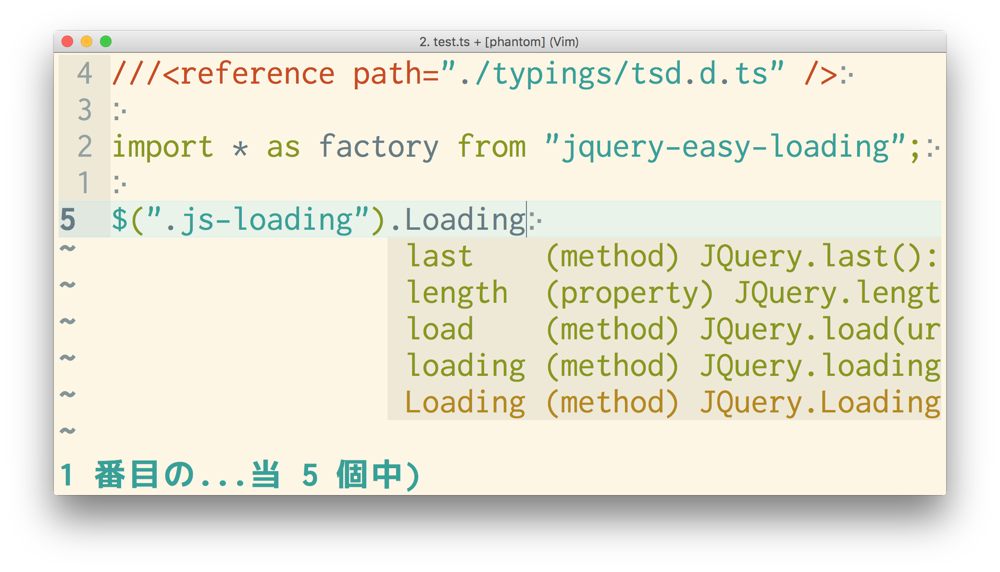

# TypeScript による<br>今風の<br>Web アプリ開発

by 陣内 靖（じんのうち やすし）

[@delphinus35](https://twitter.com/delphinus35)


## TypeScript とは……

* 次世代 JS - ECMAScript2015 の上位互換 + 型
* Microsoft 製
* オープンソース
* 各種エディタのサポートが充実
  - MS 製だけど Visual Studio は別に必要ない。
  - IntelliSense 並みのコード補完を実現するための仕組みが附属。
    - Vim でも補完できる！


## ECMAScript2015 で<br>追加された文法

* Class & Module
* Arrow Function `() => {}`
* Block Scope Variables `let, const`
* Rest / Spread Parameters `(a, b, ...args) => {}`
* New Object Literals `{some, more, props}`
* Map / Set, Promise, Generator, Symbol, ...
* 今後まだまだ増える予定（ES2017 以降?）
  - Decorator, async / await, ...


## module loading

* `some_module.js`

```typescript
export const hoge = "ほげ";
export function fuga { console.log("ふが"); }
```

* `app.js`

```typescript
import {hoge, fuga} from "./some_module";

console.log(hoge);
fuga();
```


* 今までの JS はモジュールという概念がなかった。
* 変数のスコープは関数スコープのみ。
  - `function(){ var hoge; }`
* 複数のファイルで変数・関数を共有したいと思ったらグローバル汚染するしかなかった。
  - ブラウザーなら `window.hoge = "ほげ"`
* グローバル汚染せずに複数ファイルに分けて開発が可能になった！
  - 他の言語なら当たり前の機能がやっと……！


## TypeScript は ES2015 + 型

```typescript
let hoge: string = "ほげ";

// hoge = 1; #=> 型が string でないのでエラー！

// オリジナルの型を定義できる
type LogLevel = "debug" | "info" | "warn" | "error" | "fatal";

function log(level: LogLevel, message: string) {
  console.log(`[${level}] ${message}`);
}

// log("waaarn", "fugafuga");
// #=> 第1引数の型が LogLevel と合致しないのでエラー！
```


* コンパイル時にエラーを見つけてくれる。
* とかくフリーダムになりがちな JavaScript では凄く助かる。
* 今回のプロジェクトではテストとかないのに、コンパイル通ったら一発で動いた！スゴイ！  
  <small>テストは書くべきだけどね……（結局書いてない）</small>


# 実践

* TypeScript を Rails プロジェクトで使ってみた。
* その中で遭遇した諸々。


## 既存ライブラリーは<br>npm で管理

* jQuery とか underscore.js とかいろいろ使いたいときもある。
* 大体のライブラリーは [npm][] に登録してあるし、してないものは github から直で入れる。

  ```sh
  # jQuery のインストール
  npm install -DE jquery
  ```

* bower? 何それ (^q^)

[npm]: https://www.npmjs.com


## ツールはグローバルに<br>インストールしない

* 今までは gulp や typescript 等の関連ツールをグローバルにインストールして使ってた。
  ```sh
  npm install -g typescript
  # /usr/local/bin/typescript に入る
  ```
* これだと各人が入れたバージョンを管理できない＞＜
* ビルドした結果が違うと開発に齟齬を来す。


## 各種ツールは npm 経由で実行

* ツールのインストール先はプロジェクトローカル。
  ```sh
  npm install -DE gulp
  # node_modules/.bin/gulp に入る
  ```
* gulp や browserify 等のツールも全部 npm 経由で実行する。
* `package.json` にタスクを書いて、`npm run` で実行。
  ```sh
  npm start         # gulp 起動
  npm run build     # TS をコンパイル & browserify
  npm run clean     # ビルド済みのファイルを削除
  npm run tslint    # TS の文法チェック
  npm run typedoc   # ドキュメント作成
  ...
  ```
* こうすると、必ずプロジェクトにローカルなバージョンに固定されるので開発者も戸惑わない。


## パッケージの<br>バージョン管理

* 各人の環境で、jQuery その他のライブラリや、TypeScript や gulp 等のツール類もバージョンを揃える必要がある。
* `package.json` と `npm-shrinkwrap.json` で可能。
  - Ruby で言うなら `Gemfile.lock` みたいなもの。


## 再び TypeScript の話


## 既存の JS ライブラリと<br>共存する

* 最初から TypeScript で書いてあるライブラリなんてほとんどない。
* jQuery プラグインとか使いたい！
* それ、型定義ファイルでできるよ。


## 型定義ファイル

* 既存のライブラリーが export する関数・変数などについての型情報が書いてある。
* メジャーなライブラリーについては [DefinitelyTyped][] に揃ってる。
* メジャーじゃないものは……自分で書くしかない。

[DefinitelyTyped]: https://github.com/DefinitelyTyped/DefinitelyTyped


* 書いてみた例
  - [jquery-easy-loading.d.ts][jts]
* 使用例
  

[jts]: https://github.com/DefinitelyTyped/DefinitelyTyped/blob/master/jquery-easy-loading/jquery-easy-loading.d.ts


## 書いてみた結果……

* 型定義ファイルを書くためにはライブラリーのソースを読んで理解しないといけない。
  - ドキュメントに返値の型までちゃんと書いてあれば楽なんだけどね……
* 結構大変だけど書かないと開発始められない。  
  <small>全部 any 型にキャストすれば何とかならんでもない。</small>
* 既存のライブラリーを使いたいときはこのコストとのトレードオフ。


## 複数ファイルをまとめる

* （TypeScript でも）複数ファイルでアプリを構成することはできるが、`<script>` をたくさん書くとパフォーマンス的にアレ。
* 複数のモジュールを一つにまとめ、場合によっては難読化する。


## browserify

```sh
browserify myapp.js > bundle.js
```

### before

```html
<script src="http://example.com/jquery.min.js"></script>
<script src="http://example.com/underscore.min.js"></script>
<script src="http://example.com/backbone.min.js"></script>
<script src="http://example.com/bootstrap.min.js"></script>
<script src="http://example.com/myapp.js"></script>
```

### after

```html
<script src="http://example.com/bundle.js"></script>
```

<small>ファイルサイズは相当でかくなるけどね。</small>


## Rails の<br>アセットパイプライン

* アセットパイプラインとは……
  - [アセットパイプライン | Rails日本語ドキュメント | Ruby STUDIO][as]
  - 簡単に言うと、複数の JS, CSS を連結・圧縮してくれる便利機能。Coffee や Sass からの透過的な変換もやってくれる。
  - スーパー便利すぎるが故に闇が深い＞＜

[as]: http://ruby.studio-kingdom.com/rails/guides/asset_pipeline


## アセットパイプラインと<br>共存する

* Sprockets（アセット（略）の主要 gem）を全部 JavaScript で置き換えてしまった[スゴイ人も居る][sugoi]が、ここまでやるのは大変。
* 折衷案として、browserify でビルドした一つの JS を `public/assets` に置く。
  - `app/assets/javascripts` は無視
* パッケージによっては個別の CSS / img が必要なこともある。（bootstrap とか）
  - これらは `app/assets/...` に手でコピーしてアセットパイプラインに載せる。

[sugoi]: http://waka.github.io/2015/11/25/gulp_sprockets.html


## タスクの自動化

* 定型タスクを自動化する。
  - TypeScript をコンパイル。
  - 複数ファイルをビルドしてまとめる。
  - （必要なら）難読化する。
  - （必要なら）スクリプトを所定の場所に移動する。
  - などなど……
* gulp がデファクトスタンダード。
  - Grunt? 何それ (^q^)
    - JS 界はこんなんばっかり……


## gulp

* 定型タスクの例
  ```javascript
  // JS の文法チェックを eslint で行う
  gulp.task(
    'eslint',
    () => gulp.src('gulp/**/*.js')
      .pipe(plumber({errorHandler: handleErrors}))
      .pipe(eslint())
      .pipe(eslint.failOnError())
      .pipe(plumber.stop())
  );
  ```


* だいぶ秘伝のタレ化してしまった。
* プロジェクト固有のバッドノウハウの固まりなので一般化できない。メンテもしにくい。
* せめて ES2015 で書いて eslint かけることで品質を担保。
* gulp 自体バージョン変わると文法もごりごり変わるし、プロダクト自体すぐにオワコン化する。  
  <small>Grunt ェ……</small>
  - この辺はホント JS キツイ。
  - 根本的な解決策は今のところない。


## フロントエンドの<br>ログを取りたい！

* 普通の Web アプリなら `console.log()` で十分。
* でも WebView で表示してるときのログは見れない。
* 本番環境ではユーザーの端末で致命的なエラーが起こったときに教えて欲しい。


## ログをバックエンドに送るモジュールを書く

```typescript
Logger.fatal = (message: string): JQueryPromise<{}> => {
  const level = "fatal";
  return $.post("/log", {level, message});
};

// 他にも Logger.info とか Logger.debug とか……
```
* でもこれだと、どこでログを吐いたのか分からない。  
  (´・ω・｀)


## Stacktrace-js

* https://github.com/stacktracejs/stacktrace.js

  ```typescript
  // logger.ts
  Logger.fatal = (message: string): Promise<{}> => {
    const level = "fatal";
    return StackTrace
      .get()
      .then((stackframes: StackTrace.StackFrame[]) =>
        Promise.resolve(
          $.post("/log", {level, message, stackframes})
        )
      );
  };

  // hogehoge.ts
  export class hoge {
    fuga() {
      Logger.fatal("ERROR!!!");
    }
  }
  ```


* スタックトレースが取れるスゴイやつ。
  - Perl とか Ruby の `caller` みたいなの。
  - なんでこんな基本的なものが JS には標準でないの（怒）
* `Promise` を返すことから分かるように、非同期に動作する。
* ソースマップなどを加味して分かりやすいログを吐いてくれるけど、結構重い。
  - 複数のスタックトレースを同時に生成しようとするとうまく吐けない。


# まとめ

* JS 界隈は常に勉強して（≒空気を読んで）行かないとすぐにおいて行かれる。 <!-- .element: class="fragment" -->
* Rails のような頼れる存在はいないので自分で道を切り開く必要がある。 <!-- .element: class="fragment" -->


* メリット
  - スゴイ勉強になる（意識高い感） <!-- .element: class="fragment" -->
  - 何もないからこそ、自分の思い通りに作れる万能感。 <!-- .element: class="fragment" -->
* デメリット <!-- .element: class="fragment" -->
  - 使ってるプロダクトがすぐオワコン化する。 <!-- .element: class="fragment" -->
  - 書いたソースがすぐ暗黒化する。 <!-- .element: class="fragment" -->
  - 一年後の自分ですらメンテできない。 <!-- .element: class="fragment" -->
* ドキュメント大事！！！ <!-- .element: class="fragment" -->


# 終わり

* [reveal.js][] 超便利！

[reveal.js]: https://github.com/hakimel/reveal.js/

[初めに戻る](#/)
